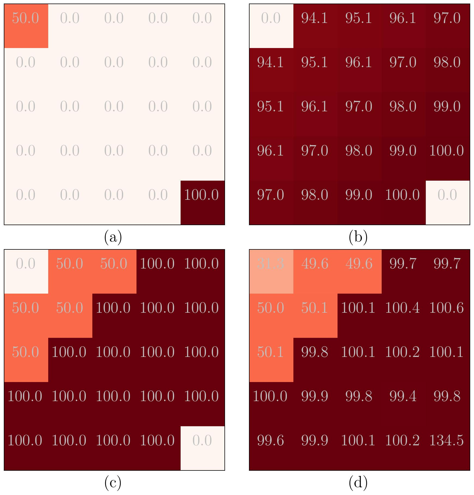
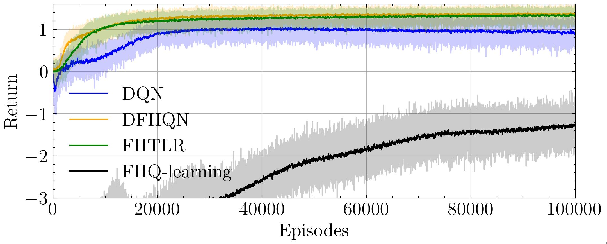

# Tensor Low-rank Approximation of Finite-horizon Value Functions

by
Sergio Rozada,
and Antonio G. Marques

This code belongs to a paper that has been published in *ICASSP 2024*.

> The associated paper presents low-rank tensor models for finite-horizon MDP value-based methods. They are easy to tune, and parametrize. Their performance is comparable to neural network methods in terms of speed of convergence, and returns.

    

*Values in a gridworld problem:
(a) original return, (b) Q-learning, (c) FHQ-learning, and (d) FHTLR-learning.*

    

*Mean return per episode in a wireless communications problem*

## Abstract

> The goal of reinforcement learning is estimating a policy that maps states to actions and maximizes the cumulative reward of a Markov Decision Process (MDP). This is oftentimes achieved by estimating first the optimal (reward) value function (VF) associated with each state-action pair. When the MDP has an infinite horizon, the optimal VFs and policies are stationary under mild conditions. However, in finite-horizon MDPs, the VFs (hence, the policies) vary with time. This poses a challenge, since the number of VFs to estimate grows not only with the size of the state-action space, but also with the time horizon. This paper proposes a non-parametric low-rank stochastic algorithm to approximate the VFs of finite-horizon MDPs. First, we represent the (unknown) VFs as a multi-dimensional array, or tensor, where time is one of the dimensions. Then, we use rewards sampled from the MDP to estimate the optimal VFs. More precisely, we use the (truncated) PARAFAC decomposition to design an online low-rank algorithm that recovers the entries of the tensor of VFs. The size of the low-rank PARAFAC model grows additively with respect to each of its dimensions, rendering our approach efficient, as demonstrated via numerical experiments.

## Software implementation

All source code used to generate the results and figures in the paper are in the `src` folder. The calculations and figure generation are all done by running:

`python main.py`

Results generated by the code are saved in `results`, and figures are saved in `figures`.

## Getting the code

You can download a copy of all the files in this repository by cloning the
[git](https://github.com/sergiorozada12/fhtlr-learning) repository:

    git clone https://github.com/sergiorozada12/fhtlr-learning.git

or [download a zip archive](https://github.com/sergiorozada12/fhtlr-learning/archive/refs/heads/main.zip).

## Dependencies

You'll need a working Python environment to run the code.
The recommended way to set up your environment is through [virtual environments](https://docs.python.org/3/library/venv.html). The required dependencies are specified in the file `requirements.txt`.
